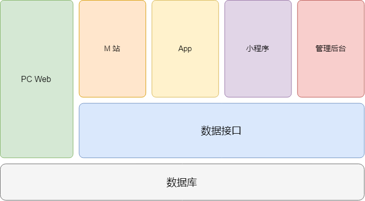

# 项目介绍

## 整体项目架构



## 功能说明

> 由于时间的关系，只实现部分主线业务功能。

1. 首页分类菜单
2. 分类商品列表分页展示
3. 商品详细信息展示
4. 加入购物车及购物车管理功能
5. 注册新用户，并发送验证邮件
6. 登录、会员中心
7. 购物车结算、支付
8. 会员资料和收货地址维护
9. 我的订单展示

## 项目运行

1. 数据库准备

   1. 创建一个空的 MySQL 数据库
   2. 执行数据库脚本初始化表结构与初始数据

2. 克隆项目到本地，进入本地项目目录

   ```shell
   $ git clone https://github.com/zce/newshop.git -b master --depth 1
   $ cd newshop
   ```

3. 安装项目模块依赖

   ```shell
   $ yarn # or npm install
   ```

4. 启动项目

   ```shell
   $ yarn start # or npm start
   ```

## 技术选型说明

| 维度   | 技术选型（主要）                                 | 说明      |
| ---- | ---------------------------------------- | ------- |
| 数据库  | MySQL                                    | 可选      |
| 服务端  | Node.js / Express / Sequelize / Handlebars | MVC     |
| 客户端  | jQuery / jQuery plugins / AJAX           | 传统客户端技术 |

## 学习目标

1. 掌握在传统的 Web 项目中前端技术的应用
2. 能够实现主线业务中的前端部分
3. 了解主线业务的后端实现过程
4. 能够说出其他常见业务实现思路