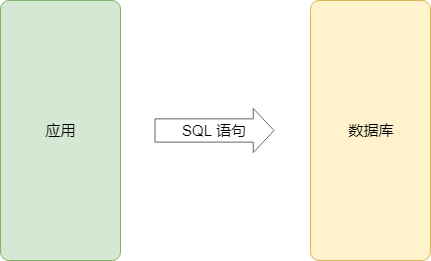
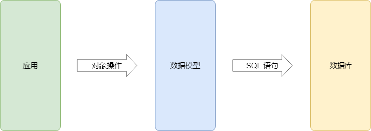

# 准备工作

## 搭建项目基础结构

### 快速生成项目结构

可以使用 `express-generator` 快速生成最基本的项目结构。

> 更推荐的方式是自己搭建，但是考虑到市面上很多的项目都是直接生成的，所以使用生成器。

**具体的操作方式：**

```shell
# 全局范围安装一个 express-generator 模块
$ yarn global add express-generator
# 定位到项目存放目录
$ cd path/to/project
# 通过生成器生成项目结构
$ express -v hbs newshop
# -v 参数用于指定所用的模板引擎，newshop 是项目名称，最终会创建同名的文件夹
# 定位到项目文件夹
$ cd newshop
# 安装依赖包
$ yarn
# 启动运行
$ yarn start
```

### 统一代码风格

采用 ECMAScript 2015 标准，Standard 风格（不强求），个人喜好，认为比较简洁统一

https://standardjs.com/readme-zhcn.html

```shell
# 项目目录安装 standard 开发依赖
$ yarn add standard --dev
# 执行 standard 模块提供的 standard 命令检测代码风格问题并修复
$ ./node_modules/bin/standard --fix
```

也可以将 `standard --fix` 命令添加到 `package.json` 中，方便后续使用：

```json
{
  "scripts": {
    "lint": "standard --fix",
    "start": "nodemon ./bin/www"
  }
}
```

### 跨平台环境变量问题

由于不同操作系统设置环境变量的方式不同，如果开发人员横跨多个操作系统，可以通过 `cross-env` 模块解决这个问题：

```shell
# 项目目录安装 cross-env 开发依赖
$ yarn add cross-env --dev
# 通过 cross-env 设置环境变量并执行后续命令
$ cross-env DEBUG=newshop:* nodemon ./bin/www
```

### 配置模板引擎

由于默认使用的 handlebars 模板引擎实现模块 `hbs` 已经很久没有维护，所以需要重新配置一个 handlebars 模板引擎模块 `express-hbs`。

可以先移除 `hbs` 然后添加 `express-hbs` 依赖：

```shell
# 移除 hbs
$ yarn remove hbs
# 添加 express-hbs
$ yarn add express-hbs
```

调整 `app.js` 中配置模板引擎的部分：

```diff
const bodyParser = require('body-parser')
+const hbs = require('express-hbs')

...

app.set('view engine', 'hbs')
+app.engine('hbs', hbs.express4())
```

模板文件中添加模板布局页申明：

```diff
+{{!< layout}}
+
<h1>{{title}}</h1>
<p>Welcome to {{title}}</p>
```

运行预览~

> 使用说明参考：
>
> - [barc/express-hbs](https://github.com/barc/express-hbs)

### 整合静态资源

默认项目中的 `public` 目录中所有文件可以被直接访问，所以我们可以将静态资源直接复制到该目录，以便于后期在页面中使用。

```diff
 ├─ public  
+│  ├─ assets
+│  │  ├─ css
+│  │  ├─ fonts
+│  │  ├─ img
+│  │  └─ js
+│  └─uploads
```

## 数据模型

> 参考文档：
>
> - [Sequelize.js Docs](http://docs.sequelizejs.com/)

### *ORM（Object Relational Mapping）

> 数据模型在现代化的 MVC 应用中是用于操作（增删改查）数据的，它存在的目的是提高数据库操作的开发效率。理解它非常简单，对比以下两张图片：

#### 原先的应用



#### 有了 ORM 过后的应用



还有一个更为重要的意义：可以切换数据库种类了，因为代码中不再是写死的 SQL 语句。

### 生成数据表模型

由于模型结构与表结构是一一对应的，所以如果已经有了数据库结构，可以借助于 `Sequelize Auto` 自动生成数据模型代码。

使用 `sequelize-auto` 的方法：

```shell
# 全局范围安装 sequelize-auto
$ yarn global add sequelize-auto
# 定位到项目所在目录，执行命令生成模型所需文件
$ sequelize-auto -h 127.0.0.1 -d newshop -u root -x wanglei
# 参数说明：
# -h 数据库主机
# -d 数据库名
# -u 数据库用户名
# -x 数据库密码
```

> 参考文档：
>
> - [sequelize/sequelize-auto](https://github.com/sequelize/sequelize-auto)

### 数据表模型调整

由于默认模型的文件名称与模型名称都是根据表名生成的，如果你是强迫症可以修改它们，如果不是，可以无视。

```diff
-module.exports = function(sequelize, DataTypes) {
+module.exports = (sequelize, DataTypes) => {
-  return sequelize.define('sp_attribute', {
+  return sequelize.define('Attribute', {
```

### 数据表模型载入

最终可以在一个主文件 `index.js` 中载入这些模型文件：

```javascript
const glob = require('glob')
const Sequelize = require('sequelize')

const config = {
  dialect: 'mysql',
  host: '127.0.0.1',
  username: 'root',
  password: 'wanglei',
  database: 'newshop',
  define: {
    timestamps: false
  }
}

const sequelize = new Sequelize(config)

// 自动匹配当前目录中所有的 js 文件
glob.sync('./*.js', { cwd: __dirname })
  // 排除掉 index.js
  .filter(item => item !== './index.js')
  .forEach(item => {
    // 挨个载入每个模型文件
    const model = sequelize.import(item)
    // 统一导出
    exports[model.name] = model
  })
```

### 数据表模型测试

在任意一个请求处理函数中通过模型查询数据：

```javascript
const { User } = require('../models')

router.get('/', (req, res, next) => {
  User.findAll().then(users => {
    res.locals.users = users
    res.render('index', { title: 'Homepage' })
  })
})
```

> 增删改查参考：
>
> - https://github.com/demopark/sequelize-docs-Zh-CN/blob/master/querying.md#%E5%9F%BA%E7%A1%80